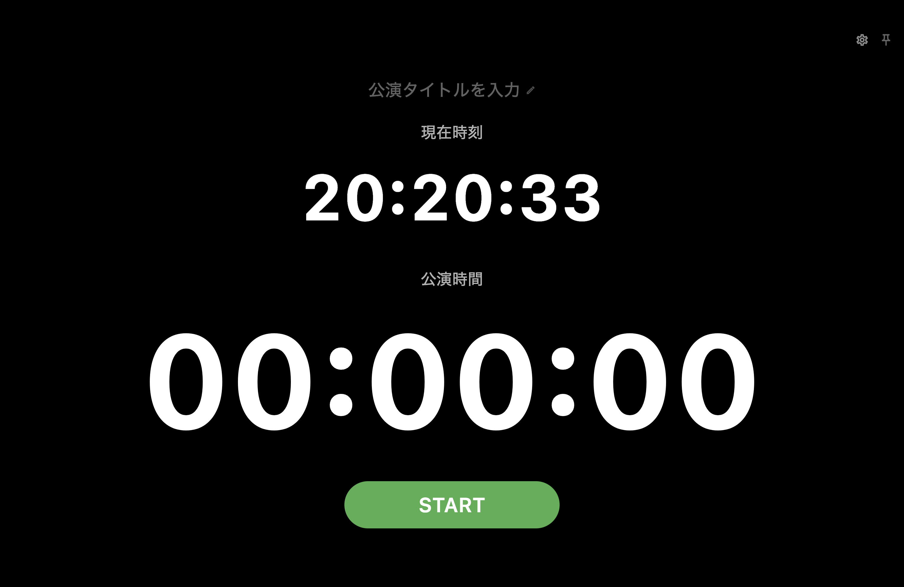

# SIGNAL FLOW Show Time

A simple show timer for stage, theatre, live-event, broadcast, presentation, and production teams.

## Current version

`1.0.0`

## Installation

### macOS

1. Download the latest `.dmg` from the **Releases** page.
2. Open the DMG.
3. Drag **SIGNAL FLOW Show Time** into the **Applications** folder.
4. Launch the application.

> If macOS warns that the app is from an unidentified developer, right-click the app and choose **Open** once.

## Features

- Start, pause, and resume with one primary control
- Hold-to-reset protection
- Editable show title
- Large elapsed-time display
- Optional current-time display
- 12-hour and 24-hour clock formats
- Japanese and English interface
- Always on Top on desktop
- Screen wake lock during use
- macOS menu and keyboard shortcuts

## macOS shortcuts

- `Space`: Start / Pause / Resume
- `Command + ,`: Preferences
- `Escape`: Close Preferences or About
- `Command + Q`: Quit

## Support

Questions and bug reports are accepted through GitHub Issues:

https://github.com/kobayashikantaro/signal-flow-show-time/issues

## Supported targets

The shared Flutter project contains targets for macOS, Windows, iOS, Android, Linux, and Web. Release validation is performed separately for each platform. RC2 is validated primarily on macOS.

## License

This project is proprietary software. Use, copying, modification, redistribution, resale, and source-code reuse are governed by the included `LICENSE` file.

Copyright © 2026 SIGNAL FLOW. All rights reserved.
